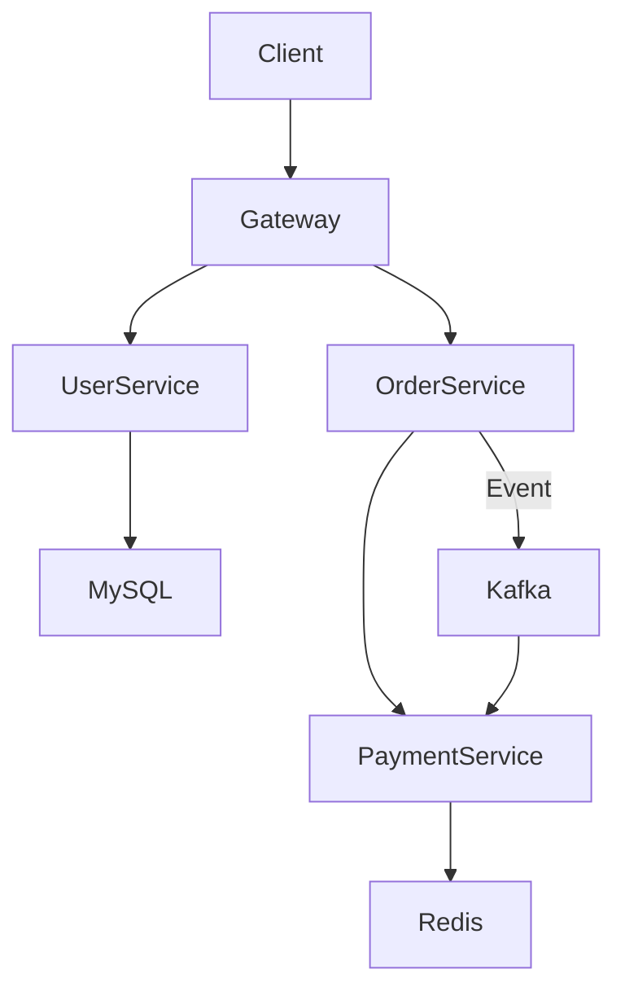

# MSA Cloud Migration Practice

## 프로젝트 개요
이 프로젝트는 **회사에서 운영 중인 모놀리식 온프레미스 시스템을 MSA 기반 클라우드 아키텍처로 전환하기 위한 사전 실습**을 목적으로 합니다.  
실제 서비스 환경 전환 전, 학습을 통해 MSA의 개념과 기술 스택을 익히고, 팀 단위로 아키텍처 설계부터 배포, 모니터링까지 경험하는 것을 목표로 합니다.

## 프로젝트 목표
- 모놀리식 구조를 MSA 서비스로 분리하는 경험 축적
- 클라우드 네이티브 환경에서 필요한 핵심 기술 학습 (CI/CD, 이벤트 처리, 캐싱, 모니터링 등)
- 팀 단위 협업을 통한 아키텍처 설계 및 운영 역량 강화

## 프로젝트 일정
- **Week 1**: 기술 스택 선정 ✅  
- **Week 2 ~ 3**: 이벤트 스토밍 → 서비스 분리  
- **Week 4**: 기술 학습 및 PoC 구현  
- **Week 5 ~ 6**: 서비스 통합 테스트, CI/CD 파이프라인 구축  
- **Week 7+**: 모니터링/로그 수집, 고도화  

📌 세부 진행 기록은 [`/docs/progress`](./docs/progress/)에서 확인할 수 있습니다.

## 기술 스택
- **Language & Framework**: Java 17, Spring Boot 3.x  
- **MSA Infra**: Spring Cloud Gateway, Eureka, Kafka, Redis, MySQL  
- **CI/CD & Container**: Docker, GitHub Actions  
- **Monitoring & Logging**: Prometheus, Grafana, Loki  

## 아키텍처 (예시)

## 실행 방법

## 📖 문서
- [Architecture](./docs/architecture.md)  
- [진행 기록](./docs/progress/)  
- [팀 역할 분담](./docs/team-roles.md)  
